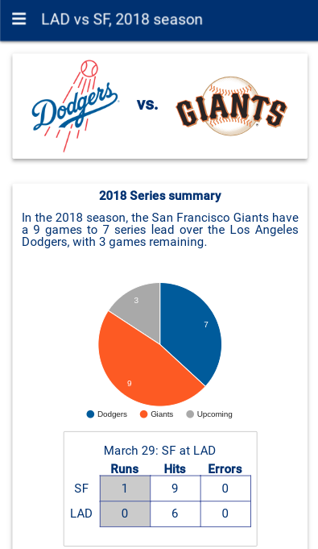

# MLB Matchup App

__View App Here:__ <https://sjlutterbie.github.io/mlb-matchup-app/>

Compare the head-to-head performance of any two MLB Teams during the 2016-2018
seasons.

_NOTE: This app uses a trial API. The data has been randomly manipulated, and
may not reflect real-world results, nor be internally consistent._

## Motivation

## Build status

## Screenshots

### Mobile screenshots

#### Landing page

> 

#### Comparison page

> 

#### Comparison page w/ Nav

> 

### Desktop screenshots

#### Landing page

> 

#### Comparison Page

> 

## Technology Used

* HTML
* CSS
* Javascript
* jQuery
* APIs:
  * [FantasyData API Solutions: MLB Data](https://developer.fantasydata.com/documentation)
  * [Google Charts](https://developers.google.com/chart/)

## Live Demo

<https://sjlutterbie.github.io/mlb-matchup-app/>